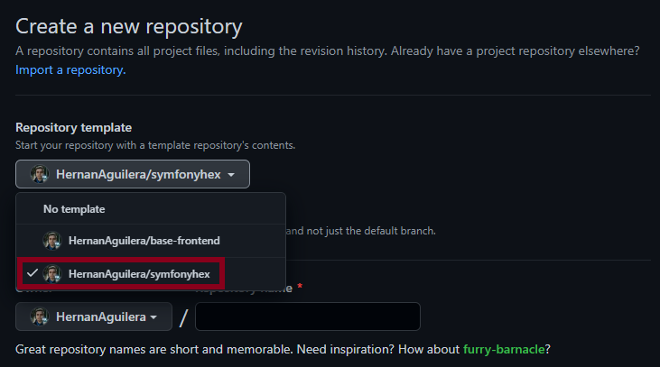

# Base API backend

This is a project creted to be used as a template to acelerated building development of api rest with symfony

## How to use?

1. Crate a new repository and use this as a template



## Installing dependencies

```bash
~$ composer install
```

## Configuring environments

### Generating ssl keys

```bash
# For development environment
~$ ./bin/console lexik:jwt:generate-keypair
# For testing environment
~$ openssl genrsa -out config/jwt/private-test.pem -aes256 4096
~$ openssl rsa -pubout -in config/jwt/private-test.pem -out config/jwt/public-test.pem
```

### Configure environment variables (dotenv file)

```bash
~$ cp .env .env.local
# The .env.testing file already exists in project directory
```

### Creating database

```bash
# For development environment
~$ php bin/console doctrine:database:create
# For testing environment
~$ php bin/console --env=test doctrine:database:create
```
